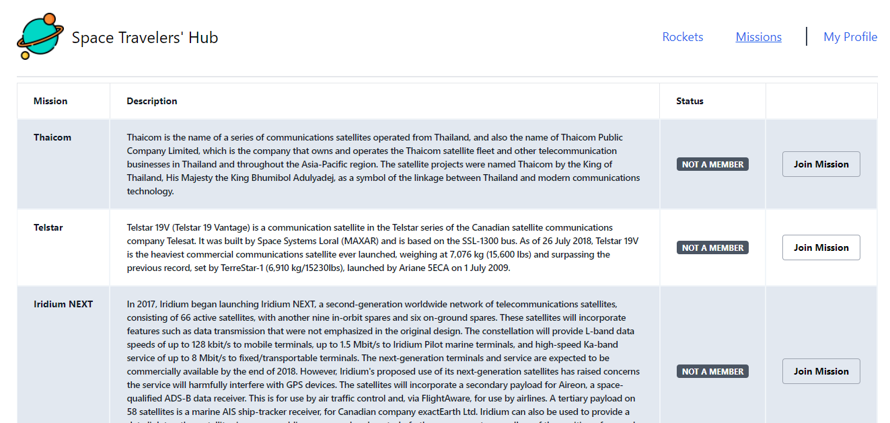
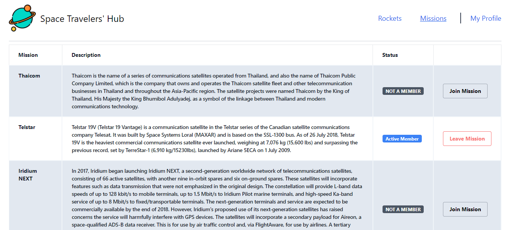

# React & Redux group project - Space Travelers' Hub

In this project, we worked with the real live data from the SpaceX API. Our task is to build a web application for a company that provides commercial and scientific space travel services. 
The application will allow users to book rockets and join selected space missions.
### ScreenShoot - Rockets Screen


### ScreenShoot - Missions Screens
<br />
<br />

## Built With

- HTML
- CSS 
- JavaScript ES6
- Tailwind CSS 
- React
- Redux
- Jest

## Live Demo

[Live Demo](demo link goes here)

## Video Documentation
[Video](Doc video link if any)

## Getting Started

To get a local copy up and running follow these simple example steps.

### Prerequisites

- Text Editor (VSCode is recommended but anyone would do)
- Node
- Web browser (Google chrome recommended)

### Development (Running locally)

- git clone the project

```bash 
git clone https://github.com/AmaduKamara/space-travelers

cd space-travelers
```

- Install dependencies

```bash
npm i 
or
npm install
```
- To Start the development server
```bash
npm start
```

- To test the project
```bash
npm run test
```

## Authors

👤 **Amadu Kamara**

- [LinkedIn](https://www.linkedin.com/in/amadu-kamara-3b60a25b)
- [GitHub](https://github.com/AmaduKamara)
- [Twitter](https://twitter.com/DevAmkam)
- [Facebook](https://www.facebook.com/amadus.kamara.7)

👤 **Evren Ersoy**

- [LinkedIn](https://www.linkedin.com/in/ewoskyx/)
- [GitHub](https://github.com/Ewoskyx)
- [Twitter](https://twitter.com/Ewoskyx)

## 🤝 Contributing

Contributions, issues and feature requests are welcome!

Please feel free to check the [issues page](https://github.com/AmaduKamara/space-travelers/issues).

## Show your support

Give a ⭐️ if you like this project!

## Acknowledgments


- Microverse 
- SpaceX API
- Postman
- TailwindCSS
- Netlify
- etc

## 📝 License

[MIT licensed](https://github.com/AmaduKamara/space-travelers/blob/dev/LICENSE).
